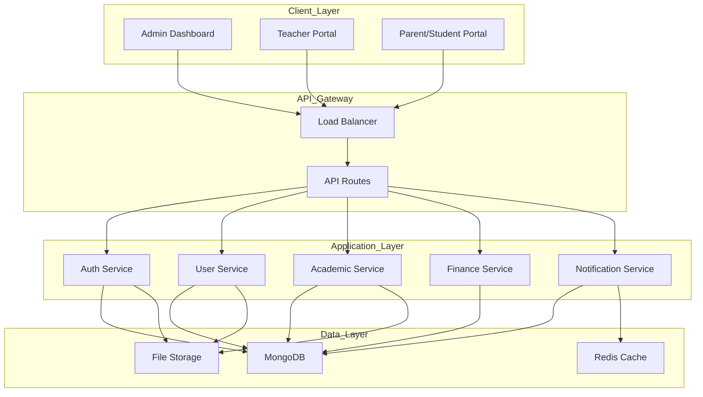
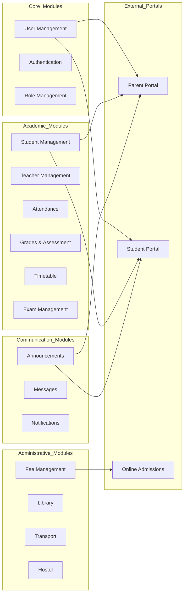

# School Management System - Technical Specification

## 1. Project Overview

### Project Name
SchoolPro - Professional School Management System

### Project Type
Full-featured K-12 School Management Web Application

### Core Feature Summary
A comprehensive school management platform designed for K-12 institutions (500-2,000 students) that streamlines administrative processes, enhances communication between stakeholders, and provides online services for parents and students.

### Target Users
- **Administrators**: School principals, vice principals,registrars
- **Teachers**: Class teachers, subject teachers, department heads
- **Students**: Primary and secondary school students
- **Parents**: Legal guardians of enrolled students
- **Staff**: Non-teaching staff (accountants, librarians, transport coordinators)

---

## 2. Technology Stack Recommendation

### Backend
- **Runtime**: Node.js v18+
- **Framework**: Express.js
- **Database**: MongoDB with Mongoose ODM
- **Authentication**: JWT (JSON Web Tokens) with refresh tokens
- **API Style**: RESTful API

### Frontend
- **Framework**: React.js 18+
- **State Management**: Redux Toolkit
- **UI Library**: Material-UI (MUI) or Ant Design
- **HTTP Client**: Axios
- **Form Handling**: React Hook Form

### Infrastructure
- **File Storage**: Cloud storage (AWS S3 or local)
- **Email Service**: Nodemailer
- **Payment Gateway**: Stripe or PayPal integration ready
- **Deployment**: Docker + AWS/DigitalOcean

---

## 3. System Architecture

### 3.1 High-Level Architecture



### 3.2 Module Architecture



---

## 4. Functional Modules Specification

### 4.1 Authentication & Authorization

#### Features
- Multi-role authentication (Admin, Teacher, Student, Parent)
- JWT-based authentication with access/refresh tokens
- Password reset via email
- Session management
- Two-factor authentication (optional)

#### User Roles & Permissions

| Role | Permissions |
|------|-------------|
| Super Admin | Full system access, school settings |
| Principal | View all data, generate reports, approve requests |
| Registrar | Manage admissions, student records |
| Accountant | Manage fees, generate financial reports |
| Librarian | Manage library, issue/return books |
| Teacher | Manage classes, attendance, grades |
| Parent | View child progress, pay fees, communicate |
| Student | View grades, attendance, timetable, assignments |

### 4.2 Student Management

#### Features
- Student registration and enrollment
- Student profile management (personal info, medical, emergency contacts)
- Class/section assignment
- Student ID generation
- Transfer/withdrawal management
- Student history tracking
- Document uploads (photos, certificates)
- Search and filter students

#### Student Data Fields
- Basic Info: First name, last name, DOB, gender, nationality
- Contact: Address, phone, email
- Academic: Roll number, class, section, academic year
- Family: Father name, mother name, guardian info
- Documents: Photo, birth certificate, previous records

### 4.3 Teacher Management

#### Features
- Teacher registration and profiles
- Department assignment
- Subject assignment
- Teacher schedule management
- Performance tracking
- Qualifications and certifications
- Leave management integration

### 4.4 Attendance Management

#### Features
- Daily attendance marking (by class/subject)
- Bulk attendance entry
- Attendance reports (daily, weekly, monthly)
- SMS/email notifications for absent students
- Leave request processing
- Attendance analytics
- Late arrival tracking

### 4.5 Grades & Assessment

#### Features
- Grade entry by subject teacher
- Grade categories (classwork, homework, midterm, final)
- Grade calculation (weighted average)
- Grade reports (progress cards)
- GPA calculation
- Transcript generation
- Academic ranking
- Grade history

#### Grade Scale (Customizable)
- A: 90-100 (Excellent)
- B: 80-89 (Very Good)
- C: 70-79 (Good)
- D: 60-69 (Pass)
- F: Below 60 (Fail)

### 4.6 Timetable Management

#### Features
- Class timetable creation
- Teacher timetable generation
- Room/venue allocation
- Period management
- Auto-conflict detection
- Weekly/monthly views
- Substitute teacher scheduling

### 4.7 Exam Management

#### Features
- Exam schedule creation
- Seating arrangement
- Marks entry
- Exam papers upload
- Result processing
- Report card generation
- Exam analytics

### 4.8 Fee Management

#### Features
- Fee structure setup term, (monthly, annual)
- Fee heads configuration
- Fee collection and receipt generation
- Online payment integration (Stripe/PayPal)
- Fee waiver and discount management
- Payment reminders
- Outstanding fee reports
- Financial reports (daily, monthly, annual)
- Installment plans

### 4.9 Library Management

#### Features
- Book catalog management
- Book issue/return
- Member management (students, teachers)
- Overdue book notifications
- Library card generation
- Book search and reservation
- Library reports

### 4.10 Transport Management

#### Features
- Vehicle management
- Route management
- Student transport assignment
- Driver management
- Transport fee tracking
- Live tracking integration (optional)
- Pickup/drop notifications

### 4.11 Online Admissions

#### Features
- Online application form
- Document upload
- Application status tracking
- Entrance exam scheduling
- Merit list generation
- Admission confirmation
- Auto-enrollment on admission

### 4.12 Parent/Student Portal

#### Features
- View attendance
- View grades and reports
- View timetable
- View fee details and make payments
- Download receipts
- View announcements
- Message teachers
- Apply for leave
- Download documents

### 4.13 Communication

#### Features
- Announcements (broadcast to classes/roles)
- Private messaging
- Email notifications
- SMS notifications (Twilio integration)
- Push notifications (web)

---

## 5. Database Schema Overview

### Core Collections

```mermaid
erDiagram
    School ||--o{ AcademicYear : has
    School ||--o{ User : employs
    School ||--o{ Class : contains
    AcademicYear ||--o{ Class : includes
    Class ||--o{ Section : has
    Class ||--o{ Student : enrolls
    Class ||--o{ Timetable : follows
    Section ||--o{ Subject : studies
    Teacher ||--o{ Subject : teaches
    Student ||--o{ Attendance : has
    Student ||--o{ Grade : receives
    Student ||--o{ FeePayment : makes
    Student ||--o{ TransportAssignment : uses
    Subject ||--o{ Exam : has
    Subject ||--o{ Assignment : has
    Book ||--o{ LibraryTransaction : issued_in
    Student ||--o{ LibraryTransaction : has
```

### Key Database Collections

1. **schools** - Multi-tenant school data
2. **users** - All user accounts
3. **students** - Student-specific data
4. **teachers** - Teacher-specific data
5. **classes** - Class/section management
6. **subjects** - Subject catalog
7. **attendance** - Daily attendance records
8. **grades** - Grade entries
9. **exams** - Exam schedules
10. **timetables** - Class and teacher schedules
11. **fees** - Fee structures
12. **payments** - Payment records
13. **books** - Library catalog
14. **transport** - Transport assignments
15. **announcements** - System announcements

---

## 6. API Structure

### 6.1 API Versioning
- Base URL: `/api/v1/`
- Authentication: Bearer token in header

### 6.2 Main API Endpoints

```
Authentication:
POST   /auth/login
POST   /auth/register
POST   /auth/refresh-token
POST   /auth/forgot-password
POST   /auth/reset-password
POST   /auth/logout

Users:
GET    /users
GET    /users/:id
POST   /users
PUT    /users/:id
DELETE /users/:id

Students:
GET    /students
GET    /students/:id
POST   /students
PUT    /students/:id
DELETE /students/:id
GET    /students/:id/profile

Teachers:
GET    /teachers
GET    /teachers/:id
POST   /teachers
PUT    /teachers/:id
DELETE /teachers/:id

Classes:
GET    /classes
GET    /classes/:id
POST   /classes
PUT    /classes/:id
DELETE /classes/:id
GET    /classes/:id/students

Attendance:
GET    /attendance
POST   /attendance/mark
GET    /attendance/student/:id
GET    /attendance/class/:id

Grades:
GET    /grades
POST   /grades
PUT    /grades/:id
GET    /grades/student/:id
GET    /grades/class/:id

Fees:
GET    /fees
POST   /fees
PUT    /fees/:id
POST   /fees/collect
GET    /fees/outstanding

Payments:
GET    /payments
POST   /payments
GET    /payments/student/:id

Exams:
GET    /exams
POST   /exams
PUT    /exams/:id
GET    /exams/schedule

Timetable:
GET    /timetable/class/:id
GET    /timetable/teacher/:id
POST   /timetable

Library:
GET    /library/books
POST   /library/books
POST   /library/issue
POST   /library/return

Transport:
GET    /transport/routes
POST   /transport/assign
GET    /transport/student/:id

Announcements:
GET    /announcements
POST   /announcements
```

---

## 7. Security Requirements

### Authentication Security
- JWT with 15-minute access token expiry
- Refresh tokens with 7-day expiry
- Password hashing with bcrypt (12 rounds)
- Rate limiting on login attempts

### Data Security
- HTTPS everywhere
- Input validation and sanitization
- SQL injection prevention (MongoDB parameterized queries)
- XSS protection
- CSRF tokens

### Access Control
- Role-based access control (RBAC)
- Resource-level permissions
- Audit logging for sensitive actions

### Data Protection
- Regular backups
- Encryption at rest for sensitive data
- Data retention policies

---

## 8. Deployment Strategy

### Development Environment
- Local development with Docker
- Hot reload for both frontend and backend

### Staging Environment
- Separate staging server
- Automated testing on push

### Production Environment
- Containerized deployment (Docker)
- Load balancer with auto-scaling
- CDN for static assets
- Database clustering
- Automated backups

---

## 9. Project Milestones

### Phase 1: Foundation (Week 1-2)
- Project setup and configuration
- Authentication system
- User management
- Role-based access control

### Phase 2: Core Academic (Week 3-5)
- Student management
- Teacher management
- Class management
- Attendance system
- Grade management

### Phase 3: Operations (Week 6-7)
- Fee management
- Library system
- Transport system
- Exam management
- Timetable

### Phase 4: Communication (Week 8)
- Announcements
- Messaging
- Notifications
- Parent portal

### Phase 5: Online Services (Week 9)
- Online admissions
- Online payments
- Student portal

### Phase 6: Polish (Week 10)
- Testing
- Bug fixes
- Performance optimization
- Documentation

---

## 10. Non-Functional Requirements

### Performance
- Page load time < 3 seconds
- API response time < 500ms
- Support for 100 concurrent users

### Scalability
- Horizontal scaling capability
- Database indexing for performance
- Caching strategy (Redis)

### Reliability
- 99.5% uptime
- Automated backups
- Error handling and logging

### Usability
- Responsive design (mobile, tablet, desktop)
- Intuitive navigation
- Accessibility compliance (WCAG 2.1)

---

## 11. Future Enhancements

- Mobile apps (iOS/Android)
- AI-based analytics
- Video conferencing integration
- Learning Management System (LMS)
- Examination system with online proctoring
- Integration with government education portals
